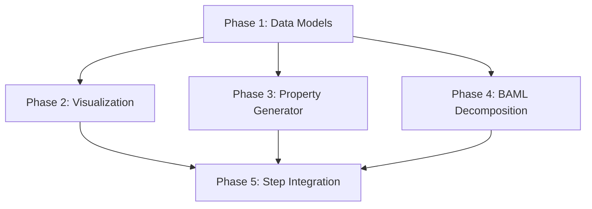

# Iterative Requirement Decomposition - TDD Implementation

## Overview

This implementation adds an **iterative requirement decomposition loop** to the planning pipeline that:
1. Takes research output and produces hierarchical requirements
2. Generates Mermaid diagrams for visualization
3. Derives Hypothesis property tests from acceptance criteria
4. Integrates between `step_research()` and `step_planning()`

## Phase Summary

| Phase | Title | Human-Testable Function | Status |
|-------|-------|------------------------|--------|
| 1 | [Data Models](./2026-01-02-tdd-iterative-requirement-decomposition-01-phase-1.md) | `RequirementNode` round-trip serialization | ✅ Complete |
| 2 | [Visualization](./2026-01-02-tdd-iterative-requirement-decomposition-02-phase-2.md) | `generate_requirements_mermaid()` | ✅ Complete |
| 3 | [Property Generator](./2026-01-02-tdd-iterative-requirement-decomposition-03-phase-3.md) | `generate_test_skeleton()` | Pending |
| 4 | [BAML Decomposition](./2026-01-02-tdd-iterative-requirement-decomposition-04-phase-4.md) | `decompose_requirements()` | Pending |
| 5 | [Step Integration](./2026-01-02-tdd-iterative-requirement-decomposition-05-phase-5.md) | `step_requirement_decomposition()` | Pending |

## Dependency Graph



## Prerequisites

```bash
# Install Hypothesis for property-based testing
pip install hypothesis pytest-hypothesis
```

## Pipeline Position

```
step_research() → [NEW: step_requirement_decomposition()] → step_planning()
```

## Files Created/Modified

| Phase | New Files | Modified Files |
|-------|-----------|----------------|
| 1 | `planning_pipeline/models.py`, `planning_pipeline/tests/test_models.py` | None |
| 2 | `planning_pipeline/visualization.py`, `planning_pipeline/tests/test_visualization.py` | None |
| 3 | `planning_pipeline/property_generator.py`, `planning_pipeline/tests/test_property_generator.py` | None |
| 4 | `planning_pipeline/decomposition.py`, `planning_pipeline/tests/test_decomposition.py` | None |
| 5 | `planning_pipeline/step_decomposition.py`, `planning_pipeline/tests/test_step_decomposition.py` | `planning_pipeline/steps.py` (optional) |

## What We're NOT Doing

- Modifying existing `step_research()` or `step_planning()` functions
- Replacing Claude CLI calls with BAML for existing steps
- Creating UI components for diagram viewing
- Real-time streaming of decomposition progress
- Database persistence of requirements

## Source Documents

- Research: `thoughts/searchable/shared/research/2026-01-02-iterative-requirement-decomposition-with-visualization.md`
- Full Plan: `thoughts/searchable/shared/plans/2026-01-02-tdd-iterative-requirement-decomposition.md`
