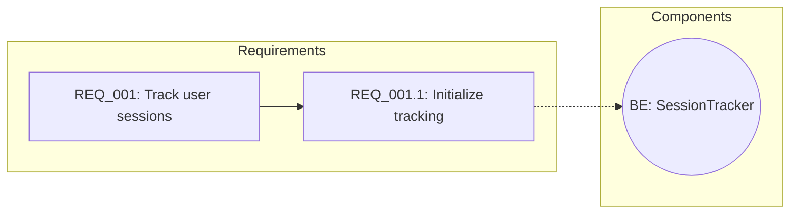
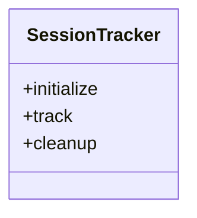

# Phase 2: Mermaid Diagram Generation

## Overview

Generate Mermaid flowchart and class diagram syntax from requirement hierarchies for visual representation of requirements and their relationships to implementation components.

## Dependencies

- **Requires**: Phase 1 (Data Models)
- **Blocks**: Phase 5 (Step Integration)

## Human-Testable Function

```python
# After implementation, verify with:
from planning_pipeline.models import RequirementNode, RequirementHierarchy
from planning_pipeline.visualization import generate_requirements_mermaid

node = RequirementNode(id="REQ_001", description="Track user sessions", type="parent")
hierarchy = RequirementHierarchy(requirements=[node])
mermaid = generate_requirements_mermaid(hierarchy)
print(mermaid)
# Output should start with "flowchart LR" and contain REQ_001
```

## Changes Required

### New Files

| File | Purpose |
|------|---------|
| `planning_pipeline/visualization.py` | Mermaid diagram generation |
| `planning_pipeline/tests/test_visualization.py` | Property and unit tests |

### planning_pipeline/visualization.py (new file)

```python
# planning_pipeline/visualization.py:1-150
def generate_requirements_mermaid(
    hierarchy: RequirementHierarchy,
    max_nodes_per_subgraph: int = 15
) -> str:
    """Generate Mermaid flowchart from requirement hierarchy."""
    # - Start with "flowchart LR"
    # - Add subgraph "Requirements" with all nodes
    # - Add edges for parent-child relationships
    # - If implementation components exist, add "Components" subgraph
    # - Link requirements to components with dashed lines

def generate_class_diagram_mermaid(hierarchy: RequirementHierarchy) -> str:
    """Generate class diagram from implementation components."""
    # - Start with "classDiagram"
    # - Extract class.method patterns from backend components
    # - Generate class definitions with methods

# Helper functions:
# _add_requirement_nodes(node, lines)
# _collect_components(hierarchy) -> Set[Tuple[str, str]]
# _make_component_id(comp_type, comp_name) -> str
# _add_component_links(node, lines)
# _extract_classes_recursive(node, classes)
```

### planning_pipeline/tests/test_visualization.py (new file)

```python
# planning_pipeline/tests/test_visualization.py:1-100
class TestMermaidFlowchartGeneration:
    # test_empty_hierarchy_produces_minimal_diagram
    # test_single_requirement_appears_as_node
    # test_parent_child_produces_edge
    # test_implementation_components_in_separate_subgraph
    # test_all_nodes_unique_in_output (property-based)
    # test_long_description_truncated

class TestMermaidClassDiagram:
    # test_backend_component_as_method_produces_class
```

## TDD Cycle

### Red Phase
```bash
pytest planning_pipeline/tests/test_visualization.py -v
# Expected: ImportError (visualization module doesn't exist)
```

### Green Phase
```bash
# Implement minimal visualization.py
pytest planning_pipeline/tests/test_visualization.py -v
# Expected: All tests pass
```

### Refactor Phase
```bash
# Add large hierarchy grouping support
pytest planning_pipeline/tests/test_visualization.py -v --hypothesis-show-statistics
# Expected: All tests pass, property tests show statistics
```

## Success Criteria

### Automated
- [x] `pytest planning_pipeline/tests/test_visualization.py -v` passes
- [x] Property test `test_all_nodes_unique_in_output` finds no counterexamples
- [x] Generated Mermaid syntax validates (manual in Mermaid Live Editor)

### Manual
- [x] Paste generated Mermaid into [Mermaid Live Editor](https://mermaid.live) - renders correctly
- [x] VS Code preview shows diagram (with Mermaid extension)
- [x] Large hierarchies (15+ nodes) are properly grouped into subgraphs
- [x] Component links (dashed lines) are visible

## Expected Output Format

### Flowchart Example


### Class Diagram Example


## Implementation Notes

1. Escape special characters in descriptions for Mermaid compatibility
2. Truncate long descriptions to 30 chars + "..."
3. Use different shapes for different node types:
   - Requirements: `["label"]` (rectangle)
   - Components: `(("label"))` (circle)
4. Group large hierarchies by ID prefix (first digit after REQ_)
5. Component IDs: `{TYPE}_{NAME}` (e.g., BE_SessionTracker, FE_Dashboard)
