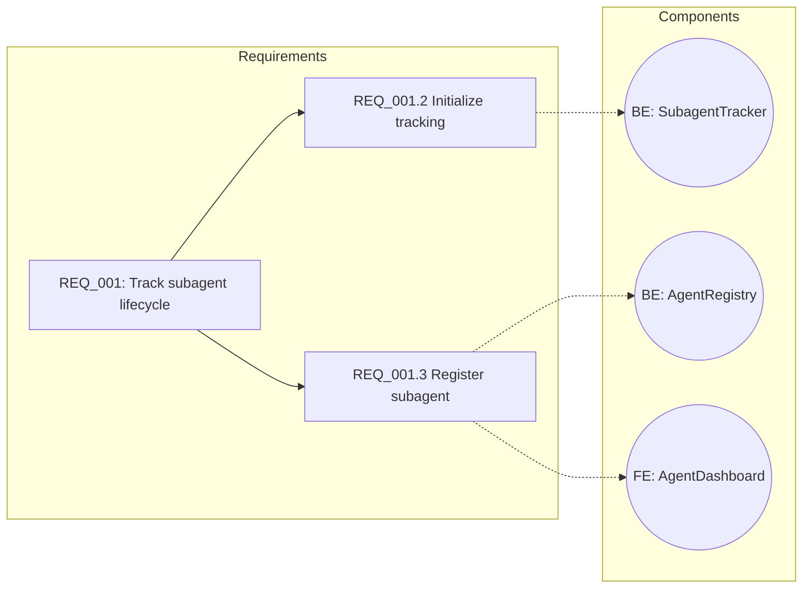

```
┌─────────────────────────────────────────────────────────────────────────────┐
│                                                                             │
│      ITERATIVE REQUIREMENT DECOMPOSITION WITH VISUALIZATION & TESTING       │
│           Building Complex Systems Bottom-Up with Property-Based TDD        │
│                                                                             │
│                      Status: COMPLETE | Date: 2026-01-02                    │
│                                                                             │
└─────────────────────────────────────────────────────────────────────────────┘
```

# Research: Iterative Requirement Decomposition with Visualization and Property-Based Testing

**Date**: 2026-01-02T10:21:09-05:00
**Researcher**: maceo
**Git Commit**: b82a157309757f73cde36f3a28eaabc6e2dbc10f
**Branch**: main
**Repository**: silmari-Context-Engine

---

## 📋 Research Question

Build an iterative loop for creating implementation requirements that:

1. **Starts with a single behavior** and builds needed functionality in micro-steps
2. **Uses BAML functions** (LLM API calls, NOT Agent SDK) for structured generation
3. **Integrates after research, before implementation planning** in the current pipeline
4. **Presents requirements via Mermaid diagrams** relating system structure to requirements
5. **Focuses on testable properties** for TDD with property chaining

---

## 📊 Summary

| Component | Pattern | Location |
|-----------|---------|----------|
| **Iterative Decomposition** | Gate-based 3-tier hierarchy | `analysis_orchestrator.py` |
| **BAML Integration** | Type-safe API calls with fallback | `baml_src/functions.baml` |
| **Mermaid Visualization** | Screen flow + relationship graphs | `gate2_interactive.py:1183-1203` |
| **Property-Based Testing** | Hypothesis + stateful testing | pytest fixtures |
| **Pipeline Position** | After research, before planning | New `step_requirement_decomposition` |

---

## 📚 Detailed Findings

### 🎯 Section 1: Iterative Requirement Decomposition Loop

The CodeWriter5 codebase implements a sophisticated **Gate-based iterative decomposition pattern** that progressively breaks down requirements.

#### 1.1 Core BAML Functions for Decomposition

| Function | Line | Purpose |
|----------|------|---------|
| `ProcessGate1InitialExtractionPrompt` | 408 | Extract top-level requirements with 4-5 sub-processes |
| `ProcessGate1SubprocessDetailsPrompt` | 618 | Break each sub-process into implementation details |
| `ProcessGate1UserInteractionsPrompt` | 878 | Expand along user interaction dimension |
| `ProcessGate1DataNeedsPrompt` | 926 | Expand along data structure dimension |
| `ProcessGate1BusinessRulesPrompt` | 975 | Expand along business rule dimension |

**Reference**: `/home/maceo/Dev/CodeWriter5/code-writer/baml_src/functions.baml`

#### 1.2 Hierarchical Structure (3-Tier)

```
REQ_001 (type: parent)
├── REQ_001.2 (type: sub_process)
│   ├── REQ_001.2.1 (type: implementation)
│   │   ├── description: "What to implement"
│   │   ├── acceptance_criteria: ["testable criterion 1", ...]
│   │   └── implementation: {frontend: [...], backend: [...], ...}
│   └── REQ_001.2.2 (type: implementation)
└── REQ_001.3 (type: sub_process)
    └── REQ_001.3.1 (type: implementation)
```

**Reference**: `/home/maceo/Dev/CodeWriter5/code-writer/src2/scope/requirements_processor.py:281-364`

#### 1.3 ImplementationComponents Schema

```python
@dataclass
class ImplementationComponents:
    frontend: list[str]    # UI components, pages, forms
    backend: list[str]     # API endpoints, services
    middleware: list[str]  # Auth, validation
    shared: list[str]      # Data models, utilities
```

---

### 🎯 Section 2: Mermaid Diagram Generation for Requirements

#### 2.1 Existing Pattern: Screen Flow Visualization

**Location**: `/home/maceo/Dev/CodeWriter5/code-writer/src2/gates/gate2_interactive.py:1183-1203`

```python
def _generate_mermaid_flowchart(self, screen_flow_data: Dict[str, Any]) -> str:
    """Generate Mermaid flowchart from screen flow data"""
    lines = ["flowchart TD"]

    # Add screens as nodes
    for page in screen_flow_data.get("pages", []):
        page_id = page["id"]
        title = page.get("title", page_id)
        lines.append(f"    {page_id}[\"{title}\"]")

    # Add transitions as edges
    for route in screen_flow_data.get("routes", []):
        from_id = route.get("from", "")
        to_id = route.get("to", "")
        trigger = route.get("trigger", "")

        if from_id and to_id:
            label = f"|{trigger}|" if trigger else ""
            lines.append(f"    {from_id} -->{label} {to_id}")

    return "\n".join(lines)
```

#### 2.2 Proposed: Requirements Hierarchy Diagram

Extend the pattern for requirement visualization:

```python
def generate_requirements_mermaid(hierarchy: RequirementHierarchy) -> str:
    """Generate Mermaid diagram relating requirements to system components."""
    lines = ["flowchart LR"]
    lines.append("    subgraph Requirements")

    for req in hierarchy.requirements:
        # Parent node with emoji indicator
        lines.append(f'    {req.id}["{req.id}: {req.description[:30]}..."]')

        for child in req.children:
            # Implementation node
            child_label = f"{child.id}\\n{child.description[:20]}..."
            lines.append(f'    {child.id}["{child_label}"]')
            lines.append(f"    {req.id} --> {child.id}")

    lines.append("    end")
    lines.append("    subgraph Components")

    # Extract unique components
    components = set()
    for req in hierarchy.requirements:
        for child in req.children:
            if child.implementation:
                for comp in child.implementation.backend:
                    components.add(("BE", comp))
                for comp in child.implementation.frontend:
                    components.add(("FE", comp))

    for comp_type, comp_name in components:
        comp_id = f"{comp_type}_{comp_name.replace(' ', '_')[:20]}"
        lines.append(f'    {comp_id}(("{comp_type}: {comp_name[:25]}"))')

    lines.append("    end")

    # Link requirements to components
    for req in hierarchy.requirements:
        for child in req.children:
            if child.implementation:
                for comp in child.implementation.backend:
                    comp_id = f"BE_{comp.replace(' ', '_')[:20]}"
                    lines.append(f"    {child.id} -.-> {comp_id}")

    return "\n".join(lines)
```

#### 2.3 Example Output



#### 2.4 Class Diagram for Data Models

For showing class structure derived from requirements:

```python
def generate_class_diagram_mermaid(hierarchy: RequirementHierarchy) -> str:
    """Generate class diagram from implementation components."""
    lines = ["classDiagram"]

    classes = {}
    for req in hierarchy.requirements:
        for child in req.children:
            if child.implementation and child.implementation.backend:
                for comp in child.implementation.backend:
                    if "." in comp:  # Method notation: Class.method()
                        class_name = comp.split(".")[0]
                        method = comp.split(".")[1]
                        if class_name not in classes:
                            classes[class_name] = {"methods": [], "properties": []}
                        classes[class_name]["methods"].append(method)

    for class_name, members in classes.items():
        lines.append(f"    class {class_name} {{")
        for method in members["methods"]:
            lines.append(f"        +{method}")
        lines.append("    }")

    return "\n".join(lines)
```

---

### 🎯 Section 3: Property-Based Testing for TDD Planning

#### 3.1 Core Concepts from Hypothesis

**Property-based testing** defines properties (invariants) that should hold for all inputs, rather than specific test cases.

| Pattern | Description | Example |
|---------|-------------|---------|
| **Round-Trip** | Inverse operations return to original | `decode(encode(x)) == x` |
| **Idempotence** | Multiple applications equal one | `sorted(sorted(lst)) == sorted(lst)` |
| **Invariants** | Properties preserved across operations | `len(sorted(lst)) == len(lst)` |
| **Oracle** | Compare against reference implementation | `my_sort(x) == builtin_sorted(x)` |

#### 3.2 Mapping Requirements to Properties

For each requirement, derive testable properties:

```python
# From requirement: "REQ_001.3.1: Implement register() method"
# acceptance_criteria: ["Must validate agent_id uniqueness",
#                       "Must set initial state to PENDING",
#                       "Must record registration timestamp"]

from hypothesis import given, strategies as st, assume
from hypothesis.stateful import RuleBasedStateMachine, rule, invariant

class SubagentTrackerProperties(RuleBasedStateMachine):
    """Property-based tests for SubagentTracker derived from requirements."""

    def __init__(self):
        super().__init__()
        self.tracker = SubagentTracker()
        self.registered_ids = set()

    # Property 1: Agent ID uniqueness (from acceptance criterion)
    @rule(agent_id=st.text(min_size=1, max_size=50))
    def register_agent(self, agent_id):
        if agent_id in self.registered_ids:
            # Should reject duplicate
            with pytest.raises(DuplicateAgentError):
                self.tracker.register(agent_id)
        else:
            self.tracker.register(agent_id)
            self.registered_ids.add(agent_id)

    # Property 2: Initial state is PENDING (from acceptance criterion)
    @invariant()
    def newly_registered_are_pending(self):
        for agent_id in self.registered_ids:
            info = self.tracker.get(agent_id)
            if info.registration_time > time.time() - 1:  # Just registered
                assert info.state == SubagentState.PENDING

    # Property 3: Registration timestamp exists (from acceptance criterion)
    @invariant()
    def all_agents_have_timestamps(self):
        for agent_id in self.registered_ids:
            info = self.tracker.get(agent_id)
            assert info.registration_time is not None
            assert info.registration_time <= time.time()

TestSubagentTracker = SubagentTrackerProperties.TestCase
```

#### 3.3 Property Chaining for Cohesive Behavior

Properties chain together when:
1. **Output of one function** becomes **input of another**
2. **State invariants** must hold across function calls
3. **Metamorphic relations** connect multiple executions

```python
# Property chain for: register -> update_status -> query_active

@st.composite
def agent_lifecycle(draw):
    """Generate a valid agent lifecycle sequence."""
    agent_id = draw(st.text(min_size=1, max_size=20))
    initial_info = draw(st.builds(AgentInfo, state=st.just(SubagentState.PENDING)))
    transitions = draw(st.lists(
        st.sampled_from([SubagentState.RUNNING, SubagentState.COMPLETED]),
        min_size=0, max_size=5
    ))
    return agent_id, initial_info, transitions

@given(agent_lifecycle())
def test_lifecycle_chain_properties(lifecycle):
    agent_id, info, transitions = lifecycle
    tracker = SubagentTracker()

    # Chain: register -> update -> query
    tracker.register(agent_id, info)

    for new_state in transitions:
        old_state = tracker.get(agent_id).state
        tracker.update_status(agent_id, new_state)

        # Property: State transition is recorded
        assert tracker.get(agent_id).state == new_state

        # Property: Active query reflects state
        active = tracker.query_active()
        if new_state == SubagentState.RUNNING:
            assert agent_id in [a.id for a in active]
        elif new_state == SubagentState.COMPLETED:
            assert agent_id not in [a.id for a in active]
```

#### 3.4 TDD Cycle with Properties

```
╔═══════════════════════════════════════════════════════════════════════════════╗
║                    TDD CYCLE WITH PROPERTY-BASED TESTING                       ║
╠═══════════════════════════════════════════════════════════════════════════════╣
║                                                                               ║
║   REQUIREMENT                                                                 ║
║   └── acceptance_criteria: ["Must validate agent_id uniqueness"]              ║
║                                                                               ║
║         │                                                                     ║
║         ▼                                                                     ║
║   ┌─────────────────────────────────────────────────────────────────────────┐ ║
║   │ 🔴 RED: Write Property Test                                              │ ║
║   │                                                                         │ ║
║   │ @given(st.text(), st.text())                                            │ ║
║   │ def test_uniqueness_property(id1, id2):                                 │ ║
║   │     assume(id1 == id2)  # Only test duplicates                          │ ║
║   │     tracker = SubagentTracker()                                         │ ║
║   │     tracker.register(id1)                                               │ ║
║   │     with pytest.raises(DuplicateAgentError):                            │ ║
║   │         tracker.register(id2)  # Should fail - duplicate                │ ║
║   │                                                                         │ ║
║   └─────────────────────────────────────────────────────────────────────────┘ ║
║         │                                                                     ║
║         ▼                                                                     ║
║   ┌─────────────────────────────────────────────────────────────────────────┐ ║
║   │ 🟢 GREEN: Minimal Implementation                                         │ ║
║   │                                                                         │ ║
║   │ def register(self, agent_id: str) -> None:                              │ ║
║   │     if agent_id in self._agents:                                        │ ║
║   │         raise DuplicateAgentError(f"Agent {agent_id} already exists")   │ ║
║   │     self._agents[agent_id] = AgentInfo(state=SubagentState.PENDING)     │ ║
║   │                                                                         │ ║
║   └─────────────────────────────────────────────────────────────────────────┘ ║
║         │                                                                     ║
║         ▼                                                                     ║
║   ┌─────────────────────────────────────────────────────────────────────────┐ ║
║   │ 🔄 REFACTOR: Hypothesis Finds Edge Cases                                 │ ║
║   │                                                                         │ ║
║   │ Hypothesis tests with 100+ inputs including:                            │ ║
║   │ - Empty strings                                                         │ ║
║   │ - Unicode characters                                                    │ ║
║   │ - Very long strings                                                     │ ║
║   │ - Whitespace-only strings                                               │ ║
║   │                                                                         │ ║
║   │ May reveal: "Agent '' already exists" - need to validate non-empty      │ ║
║   │                                                                         │ ║
║   └─────────────────────────────────────────────────────────────────────────┘ ║
║                                                                               ║
╚═══════════════════════════════════════════════════════════════════════════════╝
```

---

### 🎯 Section 4: Integration Strategy

#### 4.1 Pipeline Position

```
┌─────────────────────────────────────────────────────────────────────────────┐
│                       ENHANCED PIPELINE FLOW                                 │
├─────────────────────────────────────────────────────────────────────────────┤
│                                                                             │
│   Step 1: Research (existing)                                               │
│      │ • Claude Code CLI with research_codebase.md template                 │
│      │ • Output: research.md                                                │
│      ▼                                                                      │
│   [Checkpoint: approve/revise]                                              │
│      │                                                                      │
│      ▼                                                                      │
│   ┌─────────────────────────────────────────────────────────────────────┐   │
│   │ 🆕 Step 1.5: Requirement Decomposition                               │   │
│   │    │                                                                 │   │
│   │    ├── BAML: ProcessGate1InitialExtractionPrompt                     │   │
│   │    │   → Extract requirements with sub-processes                     │   │
│   │    │                                                                 │   │
│   │    ├── BAML: ProcessGate1SubprocessDetailsPrompt (per sub-process)   │   │
│   │    │   → Implementation details with acceptance criteria             │   │
│   │    │                                                                 │   │
│   │    ├── Generate: requirements_hierarchy.json                         │   │
│   │    │                                                                 │   │
│   │    └── Generate: requirements_diagram.mmd                            │   │
│   │        → Mermaid visualization of requirement-component links        │   │
│   │                                                                      │   │
│   └─────────────────────────────────────────────────────────────────────┘   │
│      │                                                                      │
│      ▼                                                                      │
│   [Checkpoint: review diagram, approve requirements]                        │
│      │                                                                      │
│      ▼                                                                      │
│   ┌─────────────────────────────────────────────────────────────────────┐   │
│   │ 🆕 Step 1.6: Property Derivation                                     │   │
│   │    │                                                                 │   │
│   │    ├── For each acceptance_criterion in requirements:                │   │
│   │    │   → Derive testable property                                    │   │
│   │    │   → Generate Hypothesis strategy                                │   │
│   │    │                                                                 │   │
│   │    └── Output: property_tests_skeleton.py                            │   │
│   │        → Pytest file with property-based test stubs                  │   │
│   │                                                                      │   │
│   └─────────────────────────────────────────────────────────────────────┘   │
│      │                                                                      │
│      ▼                                                                      │
│   Step 2: Planning (enhanced)                                               │
│      │ • Receives requirements_hierarchy.json as input                      │
│      │ • Uses property_tests_skeleton.py for test-first planning            │
│      │ • Output: TDD plan with test → implement cycles                      │
│      ▼                                                                      │
│   Step 3-5: (existing)                                                      │
│                                                                             │
└─────────────────────────────────────────────────────────────────────────────┘
```

#### 4.2 Data Models

```python
# planning_pipeline/models.py

from dataclasses import dataclass, field
from typing import Optional, List

@dataclass
class ImplementationComponents:
    """Component breakdown for implementation."""
    frontend: List[str] = field(default_factory=list)
    backend: List[str] = field(default_factory=list)
    middleware: List[str] = field(default_factory=list)
    shared: List[str] = field(default_factory=list)

@dataclass
class TestableProperty:
    """A property derived from acceptance criteria."""
    criterion: str              # Original acceptance criterion
    property_type: str          # invariant | round_trip | idempotence | oracle
    hypothesis_strategy: str    # e.g., "st.text(min_size=1)"
    test_skeleton: str          # Generated test code

@dataclass
class RequirementNode:
    """Single node in requirement hierarchy."""
    id: str
    description: str
    type: str  # "parent" | "sub_process" | "implementation"
    parent_id: Optional[str] = None
    children: List["RequirementNode"] = field(default_factory=list)
    sub_processes: List[str] = field(default_factory=list)
    acceptance_criteria: List[str] = field(default_factory=list)
    implementation: Optional[ImplementationComponents] = None
    testable_properties: List[TestableProperty] = field(default_factory=list)

@dataclass
class RequirementHierarchy:
    """Complete requirement hierarchy from decomposition."""
    requirements: List[RequirementNode]
    metadata: dict = field(default_factory=dict)

    def to_mermaid_flowchart(self) -> str:
        """Generate Mermaid diagram."""
        # Implementation as shown in Section 2
        pass

    def to_class_diagram(self) -> str:
        """Generate class structure diagram."""
        # Implementation as shown in Section 2
        pass

    def to_property_tests(self) -> str:
        """Generate property-based test skeleton."""
        # Implementation based on Section 3
        pass
```

#### 4.3 Implementation Checklist

| Task | Priority | File |
|------|----------|------|
| Create `models.py` with RequirementNode, TestableProperty | 🔴 High | `planning_pipeline/models.py` |
| Add `step_requirement_decomposition()` | 🔴 High | `planning_pipeline/steps.py` |
| Add Mermaid generation functions | 🔴 High | `planning_pipeline/visualization.py` |
| Add property derivation from criteria | 🟡 Medium | `planning_pipeline/property_generator.py` |
| Integrate into `PlanningPipeline.run()` | 🟡 Medium | `planning_pipeline/pipeline.py` |
| Add checkpoint for diagram review | 🟢 Low | `planning_pipeline/checkpoints.py` |

---

## 🛡️ Architecture Documentation

### Pattern Summary

```
┌─────────────────────────────────────────────────────────────────────────────┐
│                    ITERATIVE DECOMPOSITION WITH VISUALIZATION                │
├─────────────────────────────────────────────────────────────────────────────┤
│                                                                             │
│  INPUT: Research Document                                                   │
│      │                                                                      │
│      ▼                                                                      │
│  ┌───────────────────────────────────────────────────────────────────────┐  │
│  │ BAML: ProcessGate1InitialExtractionPrompt                             │  │
│  │ → requirements: [{description, sub_processes: [4-5 tasks]}]           │  │
│  └───────────────────────────────────────────────────────────────────────┘  │
│      │                                                                      │
│      ▼  (for each sub_process)                                              │
│  ┌───────────────────────────────────────────────────────────────────────┐  │
│  │ BAML: ProcessGate1SubprocessDetailsPrompt                             │  │
│  │ → implementation_details: [{description, acceptance_criteria,         │  │
│  │    implementation: {frontend, backend, middleware, shared}}]          │  │
│  └───────────────────────────────────────────────────────────────────────┘  │
│      │                                                                      │
│      ├──────────────────────────────────────────────┐                       │
│      ▼                                              ▼                       │
│  ┌────────────────────────────┐    ┌────────────────────────────────────┐   │
│  │ requirements_hierarchy.json│    │ requirements_diagram.mmd          │   │
│  │ (3-tier tree structure)   │    │ (Mermaid visualization)           │   │
│  └────────────────────────────┘    └────────────────────────────────────┘   │
│      │                                              │                       │
│      ▼                                              ▼                       │
│  ┌────────────────────────────┐    ┌────────────────────────────────────┐   │
│  │ property_tests_skeleton.py │    │ User Review                        │   │
│  │ (Hypothesis tests from     │    │ "Does diagram match expectations?" │   │
│  │  acceptance criteria)      │    │                                    │   │
│  └────────────────────────────┘    └────────────────────────────────────┘   │
│      │                                                                      │
│      ▼                                                                      │
│  OUTPUT: TDD Plan with micro-steps, tests, and component mapping            │
│                                                                             │
└─────────────────────────────────────────────────────────────────────────────┘
```

### Key Design Decisions

| Decision | Rationale |
|----------|-----------|
| BAML for decomposition | Type-safe LLM calls with schema validation |
| Mermaid for visualization | Markdown-compatible, renders in GitHub/VS Code |
| Property-based tests | Catches edge cases, derives from acceptance criteria |
| 3-tier hierarchy | Clear abstraction: behavior → task → implementation |
| Checkpoint after diagram | User validates understanding before planning |

---

## 📖 Historical Context (from thoughts/)

Related documents in thoughts/ directory:

| Document | Description |
|----------|-------------|
| `thoughts/shared/research/2026-01-02-iterative-requirement-decomposition-loop.md` | Core decomposition pattern research |
| `thoughts/shared/research/2026-01-01-pytest-fixtures-testing-patterns.md` | Pytest fixture patterns (20 fixtures) |
| `thoughts/shared/plans/2026-01-01-tdd-baml-integration.md` | TDD plan for BAML integration |
| `thoughts/shared/plans/2026-01-01-tdd-integrated-orchestrator.md` | Orchestrator TDD plan |

---

## 🔗 Related Research

- [`2026-01-02-iterative-requirement-decomposition-loop.md`](./2026-01-02-iterative-requirement-decomposition-loop.md) - Core decomposition patterns
- [`2026-01-01-baml-integration-research.md`](./2026-01-01-baml-integration-research.md) - BAML schema patterns

---

## ❓ Open Questions

1. **Diagram complexity**: How to handle diagrams with 50+ requirements without overwhelming the viewer?
2. **Property generation**: Should property derivation be LLM-assisted or rule-based?
3. **Test coverage**: How to ensure derived properties cover all acceptance criteria?
4. **Incremental updates**: How to update diagrams when requirements change?

---

## 📋 Code References

### Primary Implementation Files

| File | Purpose |
|------|---------|
| `/home/maceo/Dev/CodeWriter5/code-writer/baml_src/functions.baml:408-975` | BAML function definitions |
| `/home/maceo/Dev/CodeWriter5/code-writer/src2/scope/analysis_orchestrator.py:134-180` | Main loop orchestrator |
| `/home/maceo/Dev/CodeWriter5/code-writer/src2/scope/requirements_processor.py:173-205` | `add_child()` for hierarchy |
| `/home/maceo/Dev/CodeWriter5/code-writer/src2/gates/gate2_interactive.py:1183-1203` | Mermaid generation pattern |

### BAML Types

| File | Purpose |
|------|---------|
| `/home/maceo/Dev/CodeWriter5/code-writer/baml_src/migrated_schemas/Gate1SharedClasses.baml` | Requirement, ImplementationDetail |
| `/home/maceo/Dev/CodeWriter5/code-writer/baml_src/migrated_schemas/InitialExtractionSchema.baml` | InitialExtractionResponse |
| `/home/maceo/Dev/CodeWriter5/code-writer/baml_src/migrated_schemas/SubprocessAnalysisSchema.baml` | SubprocessAnalysisResponse |

### Property-Based Testing Resources

| Resource | URL |
|----------|-----|
| Hypothesis Documentation | https://hypothesis.readthedocs.io/ |
| Stateful Testing | https://hypothesis.readthedocs.io/en/latest/stateful.html |
| Custom Strategies | https://hypothesis.readthedocs.io/en/latest/tutorial/custom-strategies.html |
