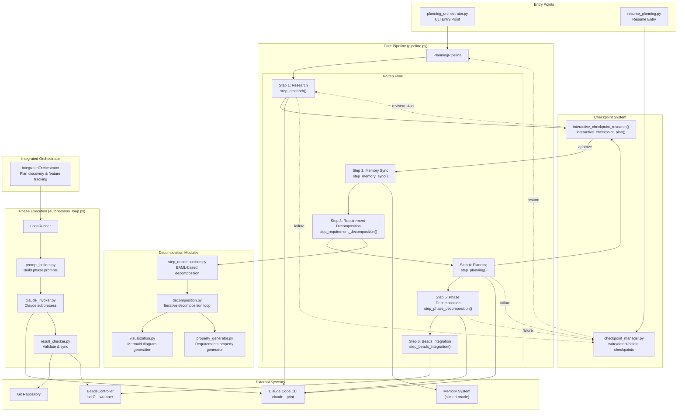

# Planning Pipeline System Architecture

## Overview

The planning pipeline is a multi-stage orchestration system that transforms research prompts into structured, trackable implementation plans. It integrates with Claude Code for LLM operations and Beads for issue tracking.

## System Diagram



## Component Details

### Entry Points

| Component | File | Purpose |
|-----------|------|---------|
| `planning_orchestrator.py` | Root | CLI entry point, handles `--resume` flag |
| `resume_planning.py` | Root | Dedicated resume functionality |

### Core Pipeline (`planning_pipeline/pipeline.py`)

**PlanningPipeline** class orchestrates the 6-step flow:

```python
class PlanningPipeline:
    def __init__(self, project_path: Path)
    def run(self, research_prompt: str, ticket_id: Optional[str], auto_approve: bool) -> dict
```

### Step Functions (`planning_pipeline/steps.py`)

| Step | Function | Input | Output | Claude Command |
|------|----------|-------|--------|----------------|
| 1 | `step_research()` | project_path, prompt | research doc path | `/research_codebase` |
| 2 | `step_memory_sync()` | project_path, research_path, session_id | sync result | `silmari-oracle` commands |
| 3 | `step_requirement_decomposition()` | project_path, research_path | hierarchy + diagram | BAML functions |
| 4 | `step_planning()` | project_path, research_path, context | plan doc path | `/create_tdd_plan` |
| 5 | `step_phase_decomposition()` | project_path, plan_path | phase files list | Direct Claude |
| 6 | `step_beads_integration()` | project_path, phase_files, epic_title | epic_id, issues | `bd` commands |

### Checkpoint System

**`checkpoints.py`** - Interactive checkpoints:
- `interactive_checkpoint_research()` - Review research, approve/revise/restart/exit
- `interactive_checkpoint_plan()` - Review plan, approve or provide feedback

**`checkpoint_manager.py`** - Persistence:
- `write_checkpoint()` - Save state with completed files and errors
- `detect_resumable_checkpoint()` - Find latest checkpoint
- `delete_checkpoint()` - Clean up on completion

### Decomposition Modules

**`step_decomposition.py`** - BAML-based structured decomposition:
- Uses `DecomposeRequirements` BAML function
- Falls back to Claude Code on BAML failure
- Generates hierarchy YAML and Mermaid diagram

**`decomposition.py`** - Iterative decomposition loop:
- `run_decomposition()` - Main entry point
- `decompose_with_visualization()` - Generate requirements with diagrams
- Multi-iteration refinement support

**`visualization.py`** - Mermaid diagram generation:
- `generate_mermaid_diagram()` - Create requirement hierarchy diagrams
- Supports customizable styling

**`property_generator.py`** - Requirements properties:
- Generate additional metadata for requirements

### Phase Execution (`planning_pipeline/autonomous_loop.py`)

**LoopRunner** class for autonomous plan execution:

```python
class LoopRunner:
    def __init__(self, plan_path, current_phase, orchestrator, project_path)
    async def run()      # Main execution loop
    async def pause()    # Pause execution
    async def resume()   # Resume from pause
```

**`phase_execution/` module:**

| File | Function | Purpose |
|------|----------|---------|
| `prompt_builder.py` | `build_phase_prompt()` | Construct prompts from plan files |
| `claude_invoker.py` | `invoke_claude()` | Subprocess invocation with timeout |
| `result_checker.py` | `check_execution_result()` | Validate results, run bd sync |

### Integrated Orchestrator (`integrated_orchestrator.py`)

**IntegratedOrchestrator** for LLM-driven plan discovery:

```python
class IntegratedOrchestrator:
    def discover_plans() -> list[PlanInfo]
    def get_next_feature() -> Optional[dict]
    def get_current_feature() -> Optional[dict]
```

### External Systems

| System | Interface | Purpose |
|--------|-----------|---------|
| Claude Code | `claude --print -p` | LLM operations |
| Beads | `BeadsController` / `bd` CLI | Issue tracking |
| Git | subprocess | Version control |
| silmari-oracle | subprocess | Memory management |

## Data Flow

### Planning Flow (Pipeline)

```
research_prompt
    │
    ▼
┌─────────────────┐
│  step_research  │ ──► research document (markdown)
└────────┬────────┘
         │
         ▼
┌─────────────────┐
│ step_memory_sync│ ──► episodic memory recorded
└────────┬────────┘
         │
         ▼
┌─────────────────────────┐
│step_requirement_decomp. │ ──► hierarchy.yaml + diagram.md
└────────┬────────────────┘
         │
         ▼
┌─────────────────┐
│  step_planning  │ ──► TDD plan document (markdown)
└────────┬────────┘
         │
         ▼
┌─────────────────────────┐
│step_phase_decomposition │ ──► phase files (01-setup.md, 02-impl.md, ...)
└────────┬────────────────┘
         │
         ▼
┌────────────────────────┐
│step_beads_integration  │ ──► epic + phase issues in Beads
└────────────────────────┘
```

### Execution Flow (LoopRunner)

```
plan_path
    │
    ▼
┌──────────────────┐
│ build_phase_prompt│ ──► formatted prompt string
└────────┬─────────┘
         │
         ▼
┌──────────────────┐
│  invoke_claude   │ ──► {success, output, error, elapsed}
└────────┬─────────┘
         │
         ▼
┌─────────────────────────┐
│ check_execution_result  │ ──► boolean (pass/fail)
└────────┬────────────────┘
         │
         ├──► git status check
         └──► bd sync
```

## State Management

### Checkpoint States

```
IDLE ──► RUNNING ──► PAUSED
              │          │
              ▼          ▼
         COMPLETED   RUNNING (resume)
              │
              ▼
           FAILED
```

### Beads Issue States

```
open ──► in_progress ──► completed
              │
              ▼
           failed
           blocked
```

## Key Interfaces

### Claude Runner (`claude_runner.py`)

```python
def run_claude_command(
    project_path: Path,
    prompt: str,
    permission_mode: str = "bypassPermissions",
    print_mode: bool = True,
    timeout: int = 300
) -> dict[str, Any]
```

### BeadsController

```python
class BeadsController:
    def create_epic(title: str, description: str) -> str
    def create_issue(title: str, description: str, type: str) -> str
    def add_dependency(issue_id: str, depends_on: str) -> bool
    def update_status(issue_id: str, status: str) -> dict
    def sync() -> dict
```

## File Locations

```
planning_pipeline/
├── __init__.py                    # Module exports
├── pipeline.py                    # PlanningPipeline class
├── steps.py                       # Step functions
├── checkpoints.py                 # Interactive checkpoints
├── checkpoint_manager.py          # Checkpoint persistence
├── step_decomposition.py          # BAML decomposition
├── decomposition.py               # Iterative decomposition
├── visualization.py               # Mermaid generation
├── property_generator.py          # Requirements properties
├── beads_controller.py            # Beads CLI wrapper
├── claude_runner.py               # Claude subprocess runner
├── autonomous_loop.py             # LoopRunner class
├── integrated_orchestrator.py     # Plan discovery
└── phase_execution/
    ├── __init__.py
    ├── prompt_builder.py          # Build prompts
    ├── claude_invoker.py          # Claude subprocess
    └── result_checker.py          # Validate results
```

## References

- Pipeline entry: `planning_orchestrator.py:1-75`
- Main pipeline: `planning_pipeline/pipeline.py:1-282`
- Step functions: `planning_pipeline/steps.py`
- Autonomous loop: `planning_pipeline/autonomous_loop.py:1-265`
- Phase execution: `planning_pipeline/phase_execution/`
- Tests: `tests/test_execute_phase.py`, `tests/test_loop_orchestrator_integration.py`
